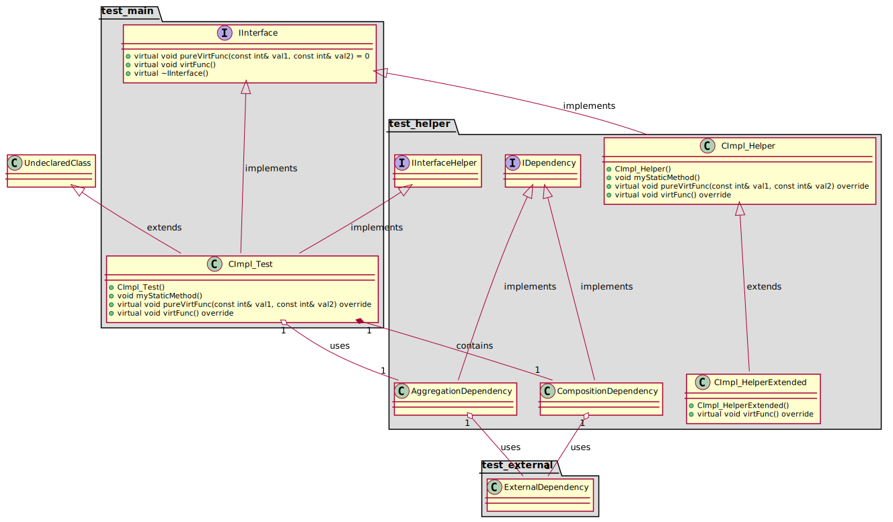

----

- Module:   DMA_Plantuml
- Version:  1.0.4
- Author:   Vladyslav Goncharuk ( svlad1990@gmail.com )

----

## Brief

Where am I?

You are on the page of the DMA_Plantuml project - the poor man's C++
to platuml converter

What it does? It allows you to declare a metadata of your classes, which is
then used to produce plantuml class diagrams. 
In other words, with DMA_Plantuml your application starts to contain information regarding its own design.

## Motivation:

Firstly, as a developer I want documentation of my source code to be located
as near as possible to the code itself. Additionally, I do not want to
maintain multiple non-connected diagrams, but rather a one single model.

Secondly, I do not want to use existing tools, which are generating the
diagrams during the build. Integration of such tools usually needs a lot of
efforts to configure them properly, and, at final point, the result diagram
is representing either the whole application ( which is overloaded with
classes ), or only a single class ( which is not informative ).

Thirdly, when user states, that there is an issue in some version of the SW,
I want to be able to get class diagrams from the SW itself, without
referring to a specific base-line in git.

Fourthly, from time to time I want to be able to review and adjust the
design of my application. When I'm doing this, I want to be able to
instantly see the result of code modification in a diagram, without the
need to refer to a thirdparty tools or files.

Fifthly, currently existing plugins for IDE-s, which allow to visulize plantuml
comments in the source code are not sufficient, as I want to review not only
the diagram of a specific single class, but also connections between
multiple classes, interfaces, packages, etc. Current concept supports
filtering out the diagram based on certain package. You are able to request
creation of diagram for the specified package and its nearest connections.

As of now, this concept is manual, but, for sure, later on it can be used as
a core module for a generator, which will produce the metadata macro-definitions on the fly.

General idea of this concept is to allow you to have UML data ( mainly class
diagrams ) of your app at your fingertips. From my previous experience, the
more overhead you have to create the documentation, the poorer it would be,
mainly due to lack of capacity to support it. With this small lib I try to
have a proper tool, which I will use at least for my own projects ☺

## Where is it actually used?

At least in this project: https://github.com/svlad-90/DLT-Message-Analyzer

----

## How to

### [Read it here](./md/how_to/how_to.md)

----

## Repo size: 

### [Read it here](./md/repo_size/repo_size.md)

----

## How do result diagrams look like?

### Full diagram

### Package diagram with external dependencies

### Package diagram without external dependencies

----
